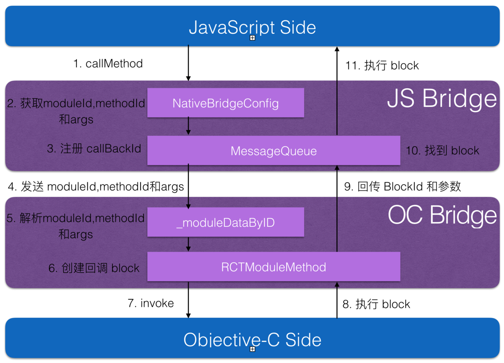

# RN-HelloWorld

## React-Native 入门级
  
## `背景`

* 用 HTML 创建 DOM，构建整个网页的布局、结构
* 用 CSS 控制 DOM 的样式，比如字体、字号、颜色、居中等
* 用 JavaScript 接受用户事件，动态的操控 DOM

##`React`

* 随着 FaceBook 推出了 React 框架，这个问题得到了大幅度改善。我们可以把一组相关的 HTML 标签，也就是 app 内的 UI 控件，封装进一个组件(Component)中
* React 是一套可以用简洁的语法高效绘制 DOM 的框架

##`React Native`

* 一个基于 JavaScript，具备动态配置能力，面向前端开发者的移动端开发框架
* Learn once，Write anywhere!
* React Native 与 Hybrid 完全没有关系

##`流程`

### Server 获取配置 --> 解析 --> 执行native代码 。

* 核心

  1,通过 HTTP 请求获取 JSON 格式的配置文件。
  
  2,配置文件中标记了每一个元素的属性，比如位置，颜色，图片 URL 等。
  
  3,解析完 JSON 后，我们调用 Objective-C 的代码，完成 UI 控件的渲染。
* Objective-C 与 JavaScript 交互

   
### 内容
   
   
## `问题`
[问题:react native 学习实践----运行facebook官方提供的例子](http://blog.csdn.net/wxq888/article/details/52413744)
##`链接`
[React Native 从入门到原理](http://www.jianshu.com/p/978c4bd3a759)

[http://www.52learn.wang/archives/category/react-native](http://www.52learn.wang/archives/category/react-native)
